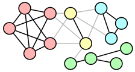

# mPW

<p align="center">
  
</p>

A clustering algorithm based on a modification of the Petford–Welsh (mPW) algorithm.

For further details about the algorithm, its implementation, advantages and limitations, and empirical results, please refer to the original paper [[1]](#1).

## Algorithm

<p align="center">
  
</p>

## Prerequisites
The [`python-igraph`](https://igraph.org/python/) package (version 0.7.1) must be installed in order to run the mPW, which can be easily done with the [`pip`](https://pip.pypa.io/en/stable/) command:
```
$ pip install python-igraph
```
(for troubleshooting, refer to the [user manual](https://igraph.org/python/#pyinstall)).

## Installing
First, clone the git repository:
```
$ git clone https://github.com/ikicab/mPW/
```
Then navigate to the downloaded folder and type the following commands into the terminal:
```
$ python setup.py build_ext --inplace
$ cython -a mPW.pyx
```

## Usage

### Input parameters
The algorithm accepts the following input parameters – note that only the input graph `g` and the initial number of clusters `k` (which may be any upper bound on the number of clusters) are mandatory.

| Parameter name | Variable type | Description | Default value (if applicable) |
| --------- | ----------- | ----------- |----------- |
| `g` | `igraph.Graph` | the (undirected) graph to be clustered | 
| `k` | `int` | the initial number of clusters (colours) |
| `maxStep` | `int` | the maximum permitted number of steps (ignored if `0`) | `0`
| `window_size` | `int` | the length of the sliding window over which the sample variance in the number of bad edges is computed | `0` or `len(g.vs)` if `maxStep == 0`
| `tol` | `float` | tolerance on the sliding-window variance | `0.001`
| `w` | `int` | the weight parameter in the probability of recolouring | `6`
| `fine_tun1` | `bool` | a flag indicating whether to recolour all leftover singleton clusters with the most frequent colours in their respective neighbourhoods as a fine-tuning step | `False`
| `fine_tun2` | `bool` | a flag indicating whether to recolour *all* vertices with the most frequent colours in their respective neighbourhoods as a fine-tuning step | `False`

### Output parameters
A division of the vertices of the given graph into clusters `c` generated by the mPW is returned along some additional informative parameters.

| Parameter name | Variable type | Description |
| --------- | ----------- | ----------- |
| `c` | `list` | an assignment of clusters (colours) to vertices
| `badVert` | `list` | the number of bad vertices over time
| `badEdges` | `list` | the number of bad edges over time
| `times` | `dict` | time elapsed during the initialisation phase, the main iterative loop, and the fine-tuning procedures

## Tutorial
See the [Tutorial](https://nbviewer.jupyter.org/github/ikicab/mPW/blob/master/Tutorial.ipynb) for more help and examples.

## References
<a id="1">[1]</a>
B. Ikica, *Clustering via a Modified Petford–Welsh Algorithm*, Ars Math. Contemp. 18(1) (2020), 33–49. _Available [here](https://doi.org/10.26493/1855-3974.2079.7b1)._\
<a id="2">[2]</a>
B. Ikica, J. Povh, J. Žerovnik, *Clustering as a Dual Problem to Colouring*. To appear in *Comput. Appl. Math.* _Available [here](https://www.researchgate.net/publication/341041631_Clustering_as_a_Dual_Problem_to_Colouring)._

The figures above were prepared with the [```LaTeX```](https://www.latex-project.org/) drawing package [```PGF/TikZ```](https://github.com/pgf-tikz/pgf).
